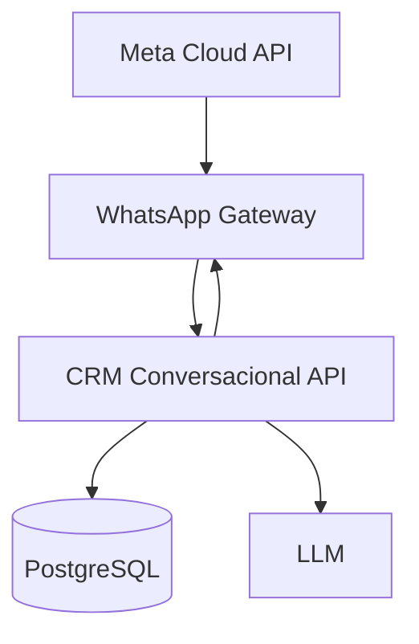

# Arquitetura

## WhatsApp Gateway

- valida webhook e assinatura da Meta;
- normaliza eventos recebidos;
- roteia eventos para a aplicação;
- envia mensagens;
- registra tentativas e status técnicos.

## CRM Conversacional API

- identifica cliente e conversa;
- consulta catálogo e produtos preferenciais;
- seleciona tabela vigente;
- calcula condições comerciais;
- cria e aprova ofertas;
- guarda mensagens e eventos;
- fornece ferramentas controladas à LLM.

## Segurança entre serviços

- HTTPS;
- chave interna rotacionável;
- assinatura HMAC do corpo;
- timestamp com janela de tolerância;
- idempotência pelo identificador externo;
- segredos apenas em variáveis de ambiente.

## Limite da LLM

A LLM pode classificar intenção e redigir respostas. Não pode calcular valores por conta própria, executar SQL livre, alterar condições comerciais ou enviar uma oferta não aprovada.
