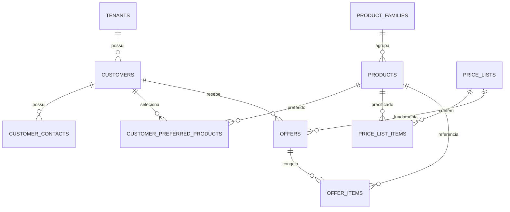

# Modelo de domínio

## Finalidade e fonte de verdade

Este documento descreve o modelo implementado em `db/migrations/0001_initial.sql`. O SQL é a fonte executável; este arquivo explica responsabilidades, campos, relacionamentos, restrições e limites arquiteturais.

A migração inicial contém **17 tabelas**. A expressão histórica “15 tabelas do MVP” não corresponde à contagem do DDL atual.

## Limite arquitetural

O `crm-conversacional-api` é o núcleo comercial determinístico: cadastro, catálogo, preços, regras, cálculo, ofertas e persistência de negócio. LLM, prompts, estado conversacional e operação do WhatsApp pertencem ao `whatsapp-webhook-caprover`.

| Situação no DDL atual | Tabelas |
|---|---|
| Permanecem no CRM | `tenants`, `customers`, `customer_contacts`, `product_families`, `products`, `customer_preferred_products`, `price_lists`, `price_list_items`, `commercial_terms`, `freight_rules`, `tax_rules`, `offers`, `offer_items` |
| Candidatas à migração para o Gateway | `conversations`, `inbound_events`, `messages`, `outbound_messages` |

As quatro tabelas candidatas são documentadas porque ainda existem na migração. A remoção exige ADR e nova migração; não deve ser feita apenas por edição retroativa de `0001_initial.sql` depois que ela tiver sido aplicada em algum ambiente.

## Visão dos agregados

| Agregado | Responsabilidade |
|---|---|
| Tenant | Isolamento lógico dos dados |
| Customer / Contact | Empresa cliente, UF e contatos comerciais |
| ProductFamily / Product | Catálogo técnico normalizado |
| PreferredProduct | Seleção, ordem e alias por cliente |
| PriceList / PriceListItem | Competência, vigência, preço e disponibilidade |
| CommercialTerm | Descontos e acréscimos determinísticos |
| FreightRule / TaxRule | Frete e tributação explícitos |
| Offer / OfferItem | Aprovação e fotografia imutável do cálculo |
| Conversation / Message | Contexto do canal; destino arquitetural: Gateway |
| InboundEvent / OutboundMessage | Idempotência e entrega; destino arquitetural: Gateway |

## Tipos enumerados

| Enum | Valores |
|---|---|
| `availability_status` | `AVAILABLE`, `OUT_OF_STOCK`, `SUSPENDED`, `FUTURE_ARRIVAL`, `CONSULT` |
| `price_list_status` | `DRAFT`, `ACTIVE`, `EXPIRED`, `CANCELLED` |
| `adjustment_type` | `PERCENT_DISCOUNT`, `PERCENT_SURCHARGE`, `AMOUNT_PER_KG` |
| `commercial_term_type` | `PAYMENT`, `MINIMUM_QUANTITY`, `OTHER` |
| `offer_status` | `DRAFT`, `PENDING_APPROVAL`, `APPROVED`, `REJECTED`, `SENT`, `FAILED`, `CANCELLED` |
| `message_direction` | `INBOUND`, `OUTBOUND` |
| `delivery_status` | `PENDING`, `SENT`, `DELIVERED`, `READ`, `FAILED` |

# Estruturas das tabelas

## 1. `tenants`

Raiz de isolamento lógico. Todas as entidades relevantes carregam `tenant_id`.

| Campo | Tipo | Nulável | Regra / significado |
|---|---|---:|---|
| `id` | uuid | não | PK; gerado por `gen_random_uuid()` |
| `name` | text | não | Nome da organização |
| `slug` | text | não | Identificador legível e único |
| `active` | boolean | não | Ativação lógica; padrão `true` |
| `created_at` | timestamptz | não | Criação; padrão `now()` |
| `updated_at` | timestamptz | não | Última atualização; padrão inicial `now()` |

Restrições: `UNIQUE(slug)`.

## 2. `customers`

Cadastro das empresas clientes atendidas pelo tenant.

| Campo | Tipo | Nulável | Regra / significado |
|---|---|---:|---|
| `id` | uuid | não | PK |
| `tenant_id` | uuid | não | FK → `tenants.id` |
| `legal_name` | text | não | Razão social |
| `trade_name` | text | sim | Nome fantasia |
| `document_number` | text | sim | Documento fiscal |
| `state_code` | char(2) | não | UF em duas letras maiúsculas |
| `active` | boolean | não | Ativação lógica |
| `created_at` | timestamptz | não | Criação |
| `updated_at` | timestamptz | não | Última atualização |

Restrições: formato da UF; `UNIQUE(tenant_id, document_number)`. Atenção: no PostgreSQL, múltiplos valores nulos continuam permitidos nessa restrição.

## 3. `customer_contacts`

Pessoas de contato e identificadores telefônicos. O telefone auxilia o Gateway a resolver o cliente antes de chamar operações comerciais.

| Campo | Tipo | Nulável | Regra / significado |
|---|---|---:|---|
| `id` | uuid | não | PK |
| `tenant_id` | uuid | não | FK → `tenants.id` |
| `customer_id` | uuid | não | FK → `customers.id` |
| `name` | text | não | Nome do contato |
| `whatsapp_e164` | text | não | Telefone no formato E.164 |
| `is_primary` | boolean | não | Indica contato principal |
| `active` | boolean | não | Ativação lógica |
| `created_at` | timestamptz | não | Criação |

Restrições: telefone compatível com `^\+[1-9][0-9]{7,14}$`; telefone único por tenant; índice parcial `ux_primary_contact_per_customer` permite no máximo um contato simultaneamente principal e ativo por cliente.

## 4. `product_families`

Agrupa produtos para navegação, apresentação e manutenção do catálogo.

| Campo | Tipo | Nulável | Regra / significado |
|---|---|---:|---|
| `id` | uuid | não | PK |
| `tenant_id` | uuid | não | FK → `tenants.id` |
| `name` | text | não | Nome da família |
| `display_order` | integer | não | Ordem de apresentação; padrão `0` |
| `active` | boolean | não | Ativação lógica |

Restrições: `UNIQUE(tenant_id, name)`.

## 5. `products`

Catálogo técnico normalizado. Não deve carregar nomes particulares de clientes.

| Campo | Tipo | Nulável | Regra / significado |
|---|---|---:|---|
| `id` | uuid | não | PK |
| `tenant_id` | uuid | não | FK → `tenants.id` |
| `family_id` | uuid | não | FK → `product_families.id` |
| `sku` | text | não | Código estável do produto |
| `commercial_name` | text | não | Nome comercial padrão |
| `specification` | text | sim | Especificação técnica |
| `unit` | text | não | Unidade; MVP aceita apenas `KG` |
| `active` | boolean | não | Ativação lógica |
| `created_at` | timestamptz | não | Criação |
| `updated_at` | timestamptz | não | Última atualização |

Restrições: `UNIQUE(tenant_id, sku)`; `CHECK(unit IN ('KG'))`.

## 6. `customer_preferred_products`

Relação cliente–produto que define seleção padrão, alias e ordenação personalizada.

| Campo | Tipo | Nulável | Regra / significado |
|---|---|---:|---|
| `id` | uuid | não | PK |
| `tenant_id` | uuid | não | FK → `tenants.id` |
| `customer_id` | uuid | não | FK → `customers.id` |
| `product_id` | uuid | não | FK → `products.id` |
| `customer_alias` | text | sim | Nome usado na comunicação com o cliente |
| `display_order` | integer | não | Ordem específica; padrão `0` |
| `include_by_default` | boolean | não | Inclusão automática na oferta |
| `active` | boolean | não | Ativação lógica |
| `created_at` | timestamptz | não | Criação |

Restrições: `UNIQUE(customer_id, product_id)`.

## 7. `price_lists`

Cabeçalho de uma tabela de preços. A competência mensal é dado, nunca parte do nome físico de uma tabela.

| Campo | Tipo | Nulável | Regra / significado |
|---|---|---:|---|
| `id` | uuid | não | PK |
| `tenant_id` | uuid | não | FK → `tenants.id` |
| `name` | text | não | Nome operacional |
| `reference_month` | date | não | Primeiro dia do mês de referência |
| `valid_from` | timestamptz | não | Início da vigência |
| `valid_until` | timestamptz | sim | Fim exclusivo/operacional da vigência |
| `currency` | char(3) | não | Moeda; padrão `BRL` |
| `base_tax_rate` | numeric(6,3) | sim | Alíquota-base entre 0 e 100 |
| `status` | price_list_status | não | Estado; padrão `DRAFT` |
| `created_at` | timestamptz | não | Criação |

Restrições: mês normalizado; fim posterior ao início; taxa entre 0 e 100; `UNIQUE(tenant_id, name, reference_month)`. Índice `ix_price_lists_current` apoia busca da lista vigente.

## 8. `price_list_items`

Preço e disponibilidade de cada produto em uma tabela.

| Campo | Tipo | Nulável | Regra / significado |
|---|---|---:|---|
| `id` | uuid | não | PK |
| `tenant_id` | uuid | não | FK → `tenants.id` |
| `price_list_id` | uuid | não | FK → `price_lists.id`; exclusão em cascata |
| `product_id` | uuid | não | FK → `products.id` |
| `base_price` | numeric(14,4) | não | Preço-base não negativo |
| `availability` | availability_status | não | Disponibilidade; padrão `CONSULT` |
| `expected_arrival_date` | date | sim | Previsão estruturada |
| `available_quantity_kg` | numeric(14,3) | sim | Quantidade disponível não negativa |
| `arrival_note` | text | sim | Complemento da previsão |
| `item_tax_rate` | numeric(6,3) | sim | Alíquota específica entre 0 e 100 |
| `notes` | text | sim | Observações comerciais |

Restrições: um produto por lista, por `UNIQUE(price_list_id, product_id)`.

## 9. `commercial_terms`

Regras explícitas de desconto ou acréscimo, gerais ou específicas por cliente.

| Campo | Tipo | Nulável | Regra / significado |
|---|---|---:|---|
| `id` | uuid | não | PK |
| `tenant_id` | uuid | não | FK → `tenants.id` |
| `price_list_id` | uuid | não | FK → `price_lists.id`; cascata |
| `customer_id` | uuid | sim | FK → `customers.id`; nulo significa regra geral |
| `term_type` | commercial_term_type | não | Categoria da condição |
| `code` | text | não | Código estável, por exemplo `ANTICIPATED` |
| `adjustment` | adjustment_type | não | Forma do ajuste |
| `adjustment_value` | numeric(14,4) | não | Valor não negativo |
| `minimum_quantity_kg` | numeric(14,3) | sim | Limiar de quantidade |
| `maximum_payment_days` | integer | sim | Prazo máximo não negativo |
| `priority` | integer | não | Precedência; padrão `100` |
| `valid_from` | timestamptz | sim | Início específico |
| `valid_until` | timestamptz | sim | Fim específico |
| `active` | boolean | não | Ativação lógica |

A API deve resolver precedência e combinação de regras de forma determinística; a LLM não calcula ajustes.

## 10. `freight_rules`

Frete por quilograma, UF, lista e opcionalmente cliente.

| Campo | Tipo | Nulável | Regra / significado |
|---|---|---:|---|
| `id` | uuid | não | PK |
| `tenant_id` | uuid | não | FK → `tenants.id` |
| `price_list_id` | uuid | não | FK → `price_lists.id`; cascata |
| `customer_id` | uuid | sim | FK → `customers.id`; especialização |
| `state_code` | char(2) | não | UF |
| `amount_per_kg` | numeric(14,4) | não | Frete unitário não negativo |
| `priority` | integer | não | Precedência |
| `active` | boolean | não | Ativação lógica |

A ausência de cliente representa regra geral para a UF.

## 11. `tax_rules`

Regras tributárias por lista, com especialização opcional por produto, cliente e UF.

| Campo | Tipo | Nulável | Regra / significado |
|---|---|---:|---|
| `id` | uuid | não | PK |
| `tenant_id` | uuid | não | FK → `tenants.id` |
| `price_list_id` | uuid | não | FK → `price_lists.id`; cascata |
| `product_id` | uuid | sim | FK → `products.id` |
| `customer_id` | uuid | sim | FK → `customers.id` |
| `state_code` | char(2) | sim | UF de aplicação |
| `tax_rate` | numeric(6,3) | não | Percentual entre 0 e 100 |
| `adjustment_per_kg` | numeric(14,4) | não | Ajuste monetário; padrão `0` |
| `priority` | integer | não | Precedência |
| `active` | boolean | não | Ativação lógica |

Nota: o DDL atual não valida o formato de `state_code` nesta tabela, ao contrário de `customers` e `freight_rules`; isso deve ser tratado em migração corretiva futura.

## 12. `conversations` — destino: Gateway

Contexto de atendimento por contato. É uma responsabilidade conversacional e não comercial determinística.

| Campo | Tipo | Nulável | Regra / significado |
|---|---|---:|---|
| `id` | uuid | não | PK |
| `tenant_id` | uuid | não | FK → `tenants.id` |
| `contact_id` | uuid | não | FK → `customer_contacts.id` |
| `channel` | text | não | No DDL atual, somente `WHATSAPP` |
| `external_thread_id` | text | sim | Referência externa |
| `opened_at` | timestamptz | não | Abertura |
| `closed_at` | timestamptz | sim | Encerramento posterior à abertura |

## 13. `inbound_events` — destino: Gateway

Inbox técnico e idempotente dos eventos recebidos.

| Campo | Tipo | Nulável | Regra / significado |
|---|---|---:|---|
| `id` | uuid | não | PK |
| `tenant_id` | uuid | não | FK → `tenants.id` |
| `external_event_id` | text | não | Identificador idempotente |
| `received_at` | timestamptz | não | Recepção |
| `event_type` | text | não | Tipo do evento |
| `payload` | jsonb | não | Evento bruto |
| `processed_at` | timestamptz | sim | Conclusão do processamento |
| `processing_error` | text | sim | Erro técnico |
| `created_at` | timestamptz | não | Persistência |

Restrições: `UNIQUE(tenant_id, external_event_id)`.

## 14. `messages` — destino: Gateway

Histórico das mensagens de canal.

| Campo | Tipo | Nulável | Regra / significado |
|---|---|---:|---|
| `id` | uuid | não | PK |
| `tenant_id` | uuid | não | FK → `tenants.id` |
| `conversation_id` | uuid | não | FK → `conversations.id` |
| `direction` | message_direction | não | Entrada ou saída |
| `external_message_id` | text | sim | ID do provedor |
| `message_type` | text | não | Tipo da mensagem |
| `body` | text | sim | Conteúdo textual |
| `raw_payload` | jsonb | sim | Representação bruta |
| `occurred_at` | timestamptz | não | Momento do evento |
| `created_at` | timestamptz | não | Persistência |

Restrições: `UNIQUE(tenant_id, external_message_id)`.

## 15. `offers`

Cabeçalho da oferta comercial, incluindo aprovação humana e referências neutras ao contexto externo.

| Campo | Tipo | Nulável | Regra / significado |
|---|---|---:|---|
| `id` | uuid | não | PK |
| `tenant_id` | uuid | não | FK → `tenants.id` |
| `customer_id` | uuid | não | FK → `customers.id` |
| `contact_id` | uuid | sim | FK → `customer_contacts.id` |
| `conversation_id` | uuid | sim | FK atual → `conversations.id`; acoplamento a remover |
| `price_list_id` | uuid | não | FK → `price_lists.id` |
| `status` | offer_status | não | Estado da oferta |
| `destination_state` | char(2) | não | UF usada no cálculo |
| `currency` | char(3) | não | Moeda |
| `payment_term_code` | text | sim | Condição selecionada |
| `message_preview` | text | sim | Campo conversacional legado |
| `final_message` | text | sim | Campo conversacional legado |
| `approved_by` | text | sim | Identidade do aprovador |
| `approved_at` | timestamptz | sim | Aprovação |
| `sent_at` | timestamptz | sim | Registro legado de envio |
| `created_at` | timestamptz | não | Criação |
| `updated_at` | timestamptz | não | Última atualização |

Restrições: estados `APPROVED` e `SENT` exigem `approved_at`; `SENT` exige `sent_at`. Índice `ix_offers_customer_created`.

A separação arquitetural futura deve substituir `conversation_id` por referência externa neutra e retirar texto final/envio do núcleo determinístico, preservando apenas o snapshot comercial e a auditoria necessária.

## 16. `offer_items`

Fotografia imutável dos itens e resultados do cálculo no momento da oferta.

| Campo | Tipo | Nulável | Regra / significado |
|---|---|---:|---|
| `id` | uuid | não | PK |
| `tenant_id` | uuid | não | FK → `tenants.id` |
| `offer_id` | uuid | não | FK → `offers.id`; cascata |
| `product_id` | uuid | não | FK → `products.id` |
| `display_order` | integer | não | Ordem apresentada |
| `display_name` | text | não | Nome congelado |
| `quantity_kg` | numeric(14,3) | sim | Quantidade positiva |
| `base_price` | numeric(14,4) | não | Preço-base congelado |
| `discount_amount_per_kg` | numeric(14,4) | não | Desconto unitário |
| `surcharge_amount_per_kg` | numeric(14,4) | não | Acréscimo unitário |
| `freight_amount_per_kg` | numeric(14,4) | não | Frete unitário |
| `tax_rate` | numeric(6,3) | sim | Alíquota utilizada |
| `final_price_per_kg` | numeric(14,4) | não | Resultado final não negativo |
| `availability` | availability_status | não | Disponibilidade congelada |
| `expected_arrival_date` | date | sim | Previsão congelada |
| `availability_note` | text | sim | Observação congelada |
| `calculation_snapshot` | jsonb | não | Entradas, regras e rastreabilidade do cálculo |

Restrições: valores monetários não negativos; quantidade positiva quando informada; `UNIQUE(offer_id, product_id)`. Após aprovação, itens não devem ser atualizados; essa imutabilidade precisa ser garantida na aplicação e futuramente por controle adicional no banco.

## 17. `outbound_messages` — destino: Gateway

Outbox técnico de envio e acompanhamento de entrega.

| Campo | Tipo | Nulável | Regra / significado |
|---|---|---:|---|
| `id` | uuid | não | PK |
| `tenant_id` | uuid | não | FK → `tenants.id` |
| `offer_id` | uuid | sim | FK → `offers.id` |
| `conversation_id` | uuid | não | FK → `conversations.id` |
| `idempotency_key` | text | não | Chave local de idempotência |
| `gateway_message_id` | text | sim | ID retornado pelo Gateway/provedor |
| `status` | delivery_status | não | Estado de entrega |
| `payload` | jsonb | não | Conteúdo técnico enviado |
| `error_message` | text | sim | Falha de envio |
| `created_at` | timestamptz | não | Criação |
| `sent_at` | timestamptz | sim | Envio |
| `delivered_at` | timestamptz | sim | Entrega |

Restrições: idempotência e ID do Gateway únicos por tenant.

# Relacionamentos principais

As FKs atuais não garantem que entidades relacionadas compartilhem o mesmo `tenant_id`. A aplicação deve validar esse invariante; uma evolução poderá adotar chaves compostas ou gatilhos para reforçá-lo no PostgreSQL.

# Estados e invariantes

## Oferta

Fluxo principal:

`DRAFT → PENDING_APPROVAL → APPROVED`

`PENDING_APPROVAL → REJECTED`

`DRAFT | PENDING_APPROVAL | APPROVED → CANCELLED`

O estado `SENT` existe no DDL atual, mas o envio é responsabilidade do Gateway. O CRM deve expor a oferta aprovada e receber, no máximo, uma referência auditável do consumo externo, sem operar a Meta Cloud API.

## Invariantes implementados

- SKU único por tenant.
- Telefone E.164 único por tenant.
- No máximo um contato principal ativo por cliente.
- Um produto preferencial por cliente.
- Um produto por tabela de preços.
- Um produto por oferta.
- Competência normalizada para o primeiro dia do mês.
- Valores monetários essenciais não negativos.
- Oferta aprovada exige data de aprovação.
- Eventos de entrada e mensagens de saída possuem chaves de idempotência.

## Invariantes ainda dependentes da aplicação ou de migração futura

- Coerência de `tenant_id` entre todas as FKs.
- Imutabilidade de `offer_items` depois da aprovação.
- Regra inequívoca de precedência entre condições, fretes e tributos.
- Exclusividade de uma tabela `ACTIVE` para o mesmo intervalo aplicável.
- Validação de UF em `tax_rules.state_code`.
- Separação física das quatro tabelas de canal para o Gateway.
- Remoção do acoplamento de `offers` a conversa, mensagem final e envio.

# Avaliação arquitetural

A estrutura comercial faz sentido para o MVP: separa catálogo, personalização por cliente, competência/vigência, disponibilidade, regras e snapshot da oferta. Ela permite cálculo auditável sem delegar valores à LLM.

O ponto que não corresponde à arquitetura desejada é a persistência conversacional dentro deste serviço. A evolução recomendada é:

1. registrar ADR formalizando o CRM como API determinística e independente de canal;
2. definir referências externas mínimas para rastreabilidade;
3. criar migração incremental que desacople `offers`;
4. transferir `conversations`, `messages`, `inbound_events` e `outbound_messages` ao `whatsapp-webhook-caprover`;
5. alinhar OpenAPI e documentação de arquitetura;
6. executar testes de regressão do cálculo e da aprovação.

Nenhuma LLM deve consultar o PostgreSQL diretamente ou calcular preço, imposto, desconto ou frete. O Gateway interpreta a intenção; a API executa operações controladas e retorna dados estruturados.
