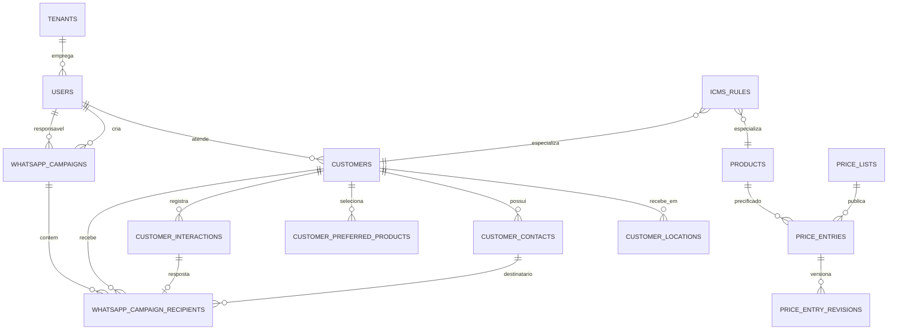

# Modelo de domínio — alvo

Este documento descreve o modelo **a construir** para a
[direção de CRM de representantes](../10_product/REPRESENTATIVE_DIRECTION.md).
O modelo **implementado hoje** continua descrito em [DOMAIN_MODEL.md](DOMAIN_MODEL.md);
enquanto as migrações `0003+` não forem aplicadas, aquele documento é a verdade.

## Resumo do delta

| Situação | Entidades |
|---|---|
| Novas | `users`, `user_sessions`, `customer_assignment_history`, `customer_locations`, `price_entries`, `price_entry_revisions`, `icms_rules`, `customer_interactions`, `whatsapp_campaigns`, `whatsapp_campaign_recipients`, `audit_log` |
| Alteradas | `tenants` (+ UF de origem), `customers` (+ titular), `price_lists` (passa a ser lote de importação) |
| Depreciadas | `tax_rules` (substituída por `icms_rules`), `freight_rules` (mantida, sem uso no corte) |
| Destino Gateway, inalterado | `conversations`, `messages`, `inbound_events`, `outbound_messages` |

---

## 1. Identidade e carteira

### `users`

Identidade autenticável do portal. Um representante é um `user` com papel
`REPRESENTATIVE`; não existe tabela separada de representantes.

| Campo | Tipo | Nulável | Regra |
|---|---|---:|---|
| `id` | uuid | não | PK |
| `tenant_id` | uuid | não | FK → `tenants.id` |
| `full_name` | text | não | Nome exibido |
| `email` | text | não | Login |
| `password_hash` | text | não | Argon2id; nunca reversível |
| `role` | user_role | não | `ADMIN`, `MANAGER`, `REPRESENTATIVE` |
| `whatsapp_e164` | text | sim | Contato do representante |
| `active` | boolean | não | Desativação lógica revoga sessões |
| `failed_login_attempts` | integer | não | Contador do bloqueio por conta |
| `locked_until` | timestamptz | sim | Bloqueio temporário após falhas seguidas |
| `last_login_at` | timestamptz | sim | Auditoria |
| `created_at` / `updated_at` | timestamptz | não | — |

Restrições: `UNIQUE(tenant_id, email)` com `CHECK (email = lower(email))` — a
normalização acontece na escrita, o que dispensa índice funcional e mantém o
comportamento idêntico em PostgreSQL e no SQLite dos testes; formato E.164
quando presente.

### `user_sessions`

Sessão com estado no servidor. Um token autocontido não atenderia ao requisito
de que desativar um usuário invalide cookies já emitidos e de que o logout
revogue de fato.

| Campo | Tipo | Nulável | Regra |
|---|---|---:|---|
| `id` | uuid | não | PK |
| `tenant_id` | uuid | não | FK → `tenants.id` |
| `user_id` | uuid | não | FK → `users.id` |
| `token_hash` | text | não | SHA-256 do token; o valor em claro só existe no cookie |
| `created_at` | timestamptz | não | Emissão |
| `last_seen_at` | timestamptz | não | Última requisição autenticada |
| `expires_at` | timestamptz | não | Fim da janela deslizante |
| `absolute_expires_at` | timestamptz | não | Teto que a renovação não ultrapassa |
| `revoked_at` | timestamptz | sim | Logout ou desativação |
| `ip_address` / `user_agent` | text | sim | Contexto da emissão |

Restrições: `UNIQUE(token_hash)`; `CHECK(absolute_expires_at >= expires_at)`.

### `customers.owner_user_id`

Coluna nova em `customers`: FK → `users.id`, nulável. É o **titular vigente** da
conta. Nulável porque um cliente pode existir sem representante designado, e
porque o backfill da base atual não tem titular.

Índice `ix_customers_owner` sobre `(tenant_id, owner_user_id, active)`.

### `customer_assignment_history`

Trilha append-only de titularidade. Existe para responder "quem atendia esta
conta em março" sem exigir join em toda consulta de carteira — por isso o
titular vigente é denormalizado em `customers.owner_user_id`.

| Campo | Tipo | Nulável | Regra |
|---|---|---:|---|
| `id` | uuid | não | PK |
| `tenant_id` | uuid | não | FK |
| `customer_id` | uuid | não | FK → `customers.id` |
| `user_id` | uuid | sim | FK → `users.id`; nulo registra remoção de titular |
| `assigned_at` | timestamptz | não | Início |
| `assigned_by` | uuid | não | FK → `users.id`; quem executou |
| `reason` | text | sim | Motivo da transferência |

Nunca sofre `UPDATE` nem `DELETE`.

### Regra de escopo

Um `user` com papel `REPRESENTATIVE` só lê e escreve `customers` onde
`owner_user_id = user.id`. `MANAGER` e `ADMIN` leem todo o tenant. **O escopo é
aplicado no repositório, não na camada de apresentação** — o risco real aqui é
IDOR por identificador de cliente em rota direta.

---

## 2. Localidade do cliente

### `customer_locations`

O ICMS depende de onde o cliente recebe, e um cliente pode receber em mais de
uma UF. `customers.state_code` permanece como UF fiscal do cadastro; a
resolução de preço usa a localidade.

| Campo | Tipo | Nulável | Regra |
|---|---|---:|---|
| `id` | uuid | não | PK |
| `tenant_id` | uuid | não | FK |
| `customer_id` | uuid | não | FK → `customers.id` |
| `label` | text | não | `Matriz`, `Filial Ribeirão`, … |
| `state_code` | char(2) | não | UF, `^[A-Z]{2}$` |
| `city` | text | sim | Município |
| `is_default` | boolean | não | Localidade usada quando nenhuma é informada |
| `active` | boolean | não | Desativação lógica |

Restrições: índice parcial garantindo **no máximo uma** localidade
simultaneamente padrão e ativa por cliente. Backfill: cada cliente existente
recebe uma localidade `Principal` com o seu `state_code` atual, marcada padrão.

---

## 3. Preço por competência

### Por que o modelo atual não serve

Hoje o preço vive em `price_list_items`, com unicidade `(price_list_id, product_id)`,
e `price_lists` é única por `(tenant_id, name, reference_month)`. Isso permite
dois preços diferentes para o mesmo produto no mesmo mês, em tabelas de nomes
diferentes — exatamente o que a chave de idempotência escolhida proíbe.

### `price_entries` — fonte de verdade do preço vigente

| Campo | Tipo | Nulável | Regra |
|---|---|---:|---|
| `id` | uuid | não | PK |
| `tenant_id` | uuid | não | FK |
| `reference_month` | date | não | Primeiro dia da competência |
| `product_id` | uuid | não | FK → `products.id` |
| `base_price` | numeric(14,4) | não | Preço-base não negativo, na UF de origem |
| `base_tax_rate` | numeric(6,3) | sim | ICMS **embutido** no `base_price`; ver Q1 |
| `availability` | availability_status | não | Padrão `CONSULT` |
| `expected_arrival_date` | date | sim | Previsão estruturada |
| `available_quantity_kg` | numeric(14,3) | sim | Não negativa |
| `arrival_note` | text | sim | Complemento |
| `notes` | text | sim | Observação comercial |
| `display_order` | integer | não | Ordem revisada |
| `source_batch_id` | uuid | sim | FK → `price_lists.id`; lote que publicou este valor |
| `published_at` | timestamptz | não | Momento da publicação |
| `published_by` | uuid | sim | FK → `users.id` |

**Restrição central:** `UNIQUE(tenant_id, reference_month, product_id)`.

Esta é a chave de idempotência pedida. Publicar o mesmo mês duas vezes é um
`UPSERT`, não uma duplicação.

### `price_entry_revisions`

Append-only. Toda gravação em `price_entries` grava aqui o valor anterior e o
novo, com autor, lote e momento. É o que permite responder "por que o preço do
produto X mudou no dia 20" — o caso concreto da tabela especial de 20/07/2026,
que neste modelo passa a ser **uma revisão dentro da competência**, não uma
segunda tabela.

| Campo | Tipo | Nulável | Regra |
|---|---|---:|---|
| `id` | uuid | não | PK |
| `tenant_id` | uuid | não | FK |
| `reference_month` | date | não | Competência |
| `product_id` | uuid | não | FK |
| `previous` | jsonb | sim | Estado anterior; nulo na primeira publicação |
| `current` | jsonb | não | Estado publicado |
| `batch_id` | uuid | sim | FK → `price_lists.id` |
| `changed_by` | uuid | sim | FK → `users.id` |
| `changed_at` | timestamptz | não | Momento |

### `price_lists` passa a ser lote de importação

`price_lists` e `price_list_items` **não são removidas**. Elas deixam de ser a
fonte de verdade e passam a representar o lote de importação revisável exigido
pelo ADR-009:

`CSV → lote DRAFT → revisão humana → ativação → UPSERT em price_entries`

A revisão continua acontecendo sobre um lote isolado; só a ativação toca o
preço vigente. `price_lists.status` ganha o valor terminal `PUBLISHED`.

### Fluxo de leitura

A tabela de um cliente é a projeção:

1. competência aplicável (a vigente, ou a informada);
2. filtrada pelos `customer_preferred_products` do cliente, na ordem e com o
   alias dele — se ele não tiver preferências, o catálogo ativo inteiro;
3. com o preço convertido para a UF da localidade dele.

---

## 4. Motor de ICMS

### UF de origem

`tenants.origin_state_code char(2)` — a UF do estabelecimento que fatura.
Obrigatória para o cálculo. Múltiplos estabelecimentos de origem por tenant
ficam para uma evolução posterior (`tenant_origins`); o corte atual assume uma
origem por tenant e falha explicitamente se ela não estiver configurada.

### `icms_rules`

| Campo | Tipo | Nulável | Regra |
|---|---|---:|---|
| `id` | uuid | não | PK |
| `tenant_id` | uuid | não | FK |
| `origin_state` | char(2) | não | UF de origem |
| `destination_state` | char(2) | não | UF de destino |
| `product_id` | uuid | sim | Especialização por produto |
| `family_id` | uuid | sim | Especialização por família |
| `customer_id` | uuid | sim | Regime específico do cliente |
| `tax_rate` | numeric(6,3) | não | Entre 0 e 100 |
| `valid_from` | date | não | Início da vigência |
| `valid_until` | date | sim | Fim exclusivo |
| `priority` | integer | não | Desempate; padrão 100 |
| `active` | boolean | não | Desativação lógica |

Restrições: ambas as UFs em `^[A-Z]{2}$`; `product_id` e `family_id` mutuamente
exclusivos; `valid_until > valid_from` quando presente.

### Precedência determinística

Candidatas: regras ativas, do par `(origem, destino)`, vigentes na data de
referência. Ordenação, da mais específica para a mais genérica:

| Ordem | Especialização |
|---:|---|
| 1 | cliente + produto |
| 2 | cliente + família |
| 3 | cliente |
| 4 | produto |
| 5 | família |
| 6 | par de UF puro |

Empate no mesmo nível: maior `priority`, depois `valid_from` mais recente. Se
ainda houver empate, o serviço **falha com erro explícito** — nunca escolhe uma
das duas em silêncio. Nenhuma regra encontrada também é erro: não existe
alíquota-padrão implícita.

### Fórmula de conversão — proposta, pendente de Q1/Q2

Assumindo o padrão brasileiro de ICMS "por dentro", em que o imposto compõe a
própria base:

```
liquido    = base_price × (1 − base_tax_rate / 100)
preco_uf   = liquido / (1 − aliquota_destino / 100)
```

Quando `base_tax_rate` é nulo, o `base_price` é tratado como líquido e apenas o
gross-up de destino é aplicado.

Arredondamento: `Decimal`, meia para cima, 4 casas no cálculo, 2 na exibição.
O resultado carrega um `calculation_trace` com regra aplicada, alíquotas de
origem e destino e valores intermediários — a mesma disciplina de auditoria do
`calculation_snapshot` de `offer_items`.

**Esta fórmula precisa de confirmação contábil antes de ser implementada.** Se
a resposta a Q2 for acréscimo simples, muda apenas o serviço de cálculo, não o
modelo de dados.

### `tax_rules` fica depreciada

A tabela atual pendura tributação em `price_list_id` e não modela o par de UFs.
Não é removida no corte (há dado potencial em produção); é marcada como
depreciada, deixa de ser lida e sai em migração posterior por ADR próprio.

---

## 5. Histórico de interações

### `customer_interactions`

Projeção de leitura, append-only, alimentada pelo Gateway. O Gateway continua
dono do canal, conforme ADR-001; o CRM guarda apenas o que a ficha do cliente
precisa exibir.

| Campo | Tipo | Nulável | Regra |
|---|---|---:|---|
| `id` | uuid | não | PK |
| `tenant_id` | uuid | não | FK |
| `customer_id` | uuid | não | FK → `customers.id` |
| `contact_id` | uuid | sim | FK → `customer_contacts.id`; nulo quando o evento não veio de um contato identificado |
| `channel` | text | não | `WHATSAPP` no corte atual |
| `direction` | interaction_direction | não | `INBOUND` / `OUTBOUND` |
| `occurred_at` | timestamptz | não | Momento no canal, não o de ingestão |
| `summary` | text | sim | Texto ou resumo, truncado em 2000 caracteres |
| `source` | text | não | `whatsapp-gateway` por padrão |
| `external_ref` | text | não | Identificador da mensagem na origem |
| `payload` | jsonb | sim | Metadado adicional |
| `created_at` | timestamptz | não | Ingestão |

Restrições: `UNIQUE(tenant_id, source, external_ref)` — é a idempotência da
ingestão. Índice `(customer_id, occurred_at DESC)` para a timeline e
`(tenant_id, occurred_at)` para o expurgo. Sem `UPDATE`, sem `DELETE` fora da
rotina de retenção.

**Três diferenças entre este alvo e a migração `0008`**, todas deliberadas:

`user_id` não existe. Ele registraria "qual representante estava envolvido", mas
os eventos vêm do Gateway, que não conhece usuários do CRM, e o portal ainda não
envia mensagem. Uma coluna sempre nula não documenta nada; ela entra quando
houver envio pelo portal.

`body` virou `summary`, truncado em 2000 caracteres. A projeção existe para dar
contexto ao representante, não para ser um arquivo da conversa — que continua no
Gateway. O nome diz o que a coluna é.

`direction` usa enum próprio, `interaction_direction`, e não `message_direction`
do Gateway. São dois bancos; reaproveitar o nome sugeriria um vínculo que não
existe.

### Ingestão

`POST /internal/interactions` — HMAC, escopo de tenant, lote de até 200 eventos,
idempotente por `(tenant, source, external_ref)`. Reenvio devolve `DUPLICATE` e
não duplica. Cada item grava em savepoint próprio: um evento recusado não
derruba os demais do lote. Contrato completo, incluindo o que cabe ao Gateway,
em [F5_INTERACTION_PUSH_CONTRACT](../40_delivery/F5_INTERACTION_PUSH_CONTRACT.md).

---

## 6. Auditoria

### `audit_log`

Append-only, exigido pela Fase A do backlog administrativo e por toda operação
do portal.

| Campo | Tipo | Nulável | Regra |
|---|---|---:|---|
| `id` | uuid | não | PK |
| `tenant_id` | uuid | sim | FK; nulo quando a ação não é atribuível a um tenant |
| `actor_user_id` | uuid | sim | FK → `users.id`; nulo para ações de serviço |
| `action` | text | não | Identificador fechado, ex. `PRICE_BATCH_PUBLISHED` |
| `entity` | text | não | Tabela ou agregado |
| `entity_id` | uuid | sim | Alvo |
| `before` / `after` | jsonb | sim | Estados |
| `occurred_at` | timestamptz | não | Momento |
| `request_id` | text | sim | Correlação |

`tenant_id` é nulável para que uma tentativa de login com e-mail inexistente —
que não pode ser atribuída a nenhum tenant nem a nenhum usuário — também deixe
rastro. Sem isso, exatamente o caso mais interessante para investigação seria o
único a não ser registrado.

---

## 7. Projeção comercial de campanhas de WhatsApp

Esta seção é o delta conceitual de uma capacidade ainda não implementada. Ela
não transfere a posse do canal para o CRM: o Gateway continua com as mensagens,
o consentimento, o opt-out, a Meta e a fila de envio. O CRM guarda o agregado
comercial que permite autorizar, auditar, listar campanhas e levá-las à ficha do
cliente. O contrato de integração proposto está em
[API_CONTRACT](../30_architecture/API_CONTRACT.md#proposta-de-contrato-para-campanhas-de-whatsapp).

### `whatsapp_campaigns`

Uma intenção comercial criada no CRM e, depois da confirmação, correlacionada à
campanha operacional criada no Gateway. Não é uma tabela espelho de
`messages`: uma campanha pode ter muitos destinatários e muitas mensagens, e o
Gateway continua sendo a fonte operacional dessas mensagens.

| Campo | Tipo | Nulável | Regra |
|---|---|---:|---|
| `id` | uuid | não | PK interna e correlação CRM |
| `tenant_id` | uuid | não | FK → `tenants.id` |
| `created_by_user_id` | uuid | não | FK → `users.id`; quem abriu o pedido |
| `representative_user_id` | uuid | sim | FK → `users.id`; responsável comercial exibido e congelado |
| `status` | campaign_status | não | Estado comercial projetado; não substitui estado por mensagem |
| `criteria_snapshot` | jsonb | não | Critérios estruturados usados na prévia, imutáveis após criação |
| `audience_summary_snapshot` | jsonb | não | Contagens, exclusões e versão/regra usada na revisão |
| `template_snapshot` | jsonb | não | Identificador operacional, idioma e metadados permitidos pelo Gateway |
| `variables_snapshot` | jsonb | sim | Variáveis de campanha; dados específicos ficam no destinatário |
| `confirmation` | jsonb | sim | Ator, momento, canal e chave idempotente da confirmação |
| `gateway_campaign_id` | text | sim | Identificador externo, único por tenant quando presente |
| `gateway_status` / `gateway_updated_at` | text / timestamptz | sim | Última projeção operacional recebida |
| `created_at` / `updated_at` | timestamptz | não | Criação e atualização da projeção |

`campaign_status` é deliberadamente estado de negócio: pelo menos `DRAFT`,
`AWAITING_CONFIRMATION`, `CONFIRMED`, `CANCELLED`, `IN_PROGRESS`, `COMPLETED` e
`FAILED`, com o detalhamento operacional nos destinatários. O vocabulário final
e as transições são parte do contrato a fechar; nenhuma transição pode pular a
confirmação explícita ou reabrir uma campanha cancelada.

### `whatsapp_campaign_recipients`

Fotografia de cada alvo revisado. Ela liga campanha → cliente → contato →
representante e permite que a ficha do cliente encontre a campanha sem
consultar o Gateway.

| Campo | Tipo | Nulável | Regra |
|---|---|---:|---|
| `id` | uuid | não | PK |
| `tenant_id` | uuid | não | FK |
| `campaign_id` | uuid | não | FK → `whatsapp_campaigns.id` |
| `customer_id` | uuid | não | FK → `customers.id` |
| `contact_id` | uuid | sim | FK → `customer_contacts.id`; nulo apenas para exclusão prévia sem contato elegível |
| `representative_user_id` | uuid | sim | FK → `users.id`; titular congelado na prévia |
| `recipient_snapshot` | jsonb | não | Dados mínimos e variáveis resolvidas, sem substituir o contato mestre |
| `eligibility_status` | text | não | Elegível ou motivo explícito de exclusão, inclusive consentimento |
| `delivery_status` | text | sim | `PENDING`, `SENT`, `DELIVERED`, `READ` ou `FAILED` quando houver evento |
| `gateway_message_id` | text | sim | Identificador externo da mensagem/tentativa |
| `response_interaction_id` | uuid | sim | FK → `customer_interactions.id`, se resposta for projetada |
| `failure_reason` / `excluded_reason` | text | sim | Resultado auditável, não texto genérico |
| `status_updated_at` / `created_at` | timestamptz | não | Ordenação e auditoria |

Restrições esperadas: unicidade da fotografia de destinatário,
`UNIQUE(tenant_id, gateway_campaign_id)` quando o identificador estiver
presente e unicidade idempotente para o evento/mensagem externa definida no
contrato. O modelo deve admitir que um cliente tenha mais de um contato, mas a
política de seleção precisa ser explícita para não enviar duas vezes por
acidente.

**Correção de 2026-09-02, ao implementar a `0015`:** este documento propunha
`UNIQUE(campaign_id, customer_id, contact_id)` para a fotografia do
destinatário. Essa forma **não funciona**. No PostgreSQL uma coluna nula não
deduplica, e `contact_id` é nulo exatamente nas linhas de exclusão sem contato
elegível — a restrição deixaria entrar duas exclusões do mesmo cliente na mesma
campanha. A `0015` implementa dois índices parciais no lugar:
`ux_wcr_contact` sobre `(campaign_id, customer_id, contact_id)` onde há
contato, e `ux_wcr_customer_without_contact` sobre `(campaign_id, customer_id)`
onde não há.

### Critérios, histórico e retenção

Os snapshots não são cache descartável: critérios, template, variáveis,
destinatários, confirmação e resultados precisam explicar o que foi aprovado
naquele dia mesmo se a carteira, um grupo ou um contato mudarem depois. Em
contrapartida, eles não autorizam acesso fora da carteira atual: a leitura de
campanha continua passando pela regra de escopo do CRM.

Eventos Gateway → CRM podem criar ou completar `customer_interactions` com a
referência de campanha no `payload`, mas não devem copiar indiscriminadamente a
conversa inteira. Retenção de campanhas, destinatários e conteúdo projetado é
decisão LGPD pendente; até ela existir, não haverá expurgo por prazo implícito.

---

## Relacionamentos-alvo



## Invariantes novos

- E-mail único por tenant, sem distinção de caixa.
- No máximo uma localidade padrão ativa por cliente.
- Um único preço vigente por `(tenant, competência, produto)`.
- Toda gravação de preço produz uma revisão.
- Resolução de ICMS é única ou falha; não há alíquota-padrão implícita.
- Ingestão de interação é idempotente por `(source, external_ref)`.
- Criação, confirmação, cancelamento e eventos de campanha são idempotentes;
  repetição não cria campanha, destinatário ou resultado adicional.
- Critérios, público, template, variáveis e confirmação de campanha são
  fotografias auditáveis; mudança posterior de cadastro não os reescreve.
- Consentimento é decidido pelo Gateway na prévia e antes do envio, e uma
  exclusão por opt-out permanece registrada no destinatário.
- Representante lê apenas a própria carteira, verificado no repositório.
- `customer_assignment_history`, `price_entry_revisions`, `customer_interactions`
  e `audit_log` nunca sofrem `UPDATE`.

## Invariantes herdados que continuam pendentes

- Coerência de `tenant_id` entre todas as FKs (hoje só na aplicação).
- Imutabilidade de `offer_items` após aprovação.
- Separação física das quatro tabelas de canal para o Gateway.
