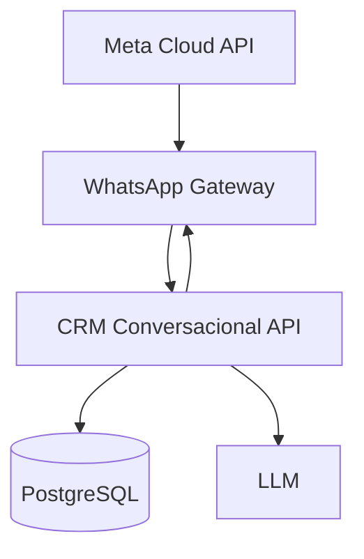

# Arquitetura

## Responsabilidades

**Gateway:** valida webhooks, normaliza e roteia eventos, envia mensagens e acompanha status técnico.

**CRM API:** identifica cliente, consulta catálogo/preços, calcula condições, cria/aprova ofertas, persiste conversas e expõe operações controladas.

**LLM:** classifica intenção e redige respostas com dados fornecidos pela API.

## Segurança entre serviços

HTTPS, assinatura HMAC, timestamp com tolerância, chave rotacionável, idempotência e segredos somente em variáveis de ambiente.

O Gateway resolve a linha Meta, o aplicativo e o fluxo antes de chamar a API. Para
cada implantação do CRM, ele repassa o slug do tenant correspondente em uma chamada
HMAC autenticada; a API nunca infere nem pesquisa tenants por telefone sem esse escopo.
